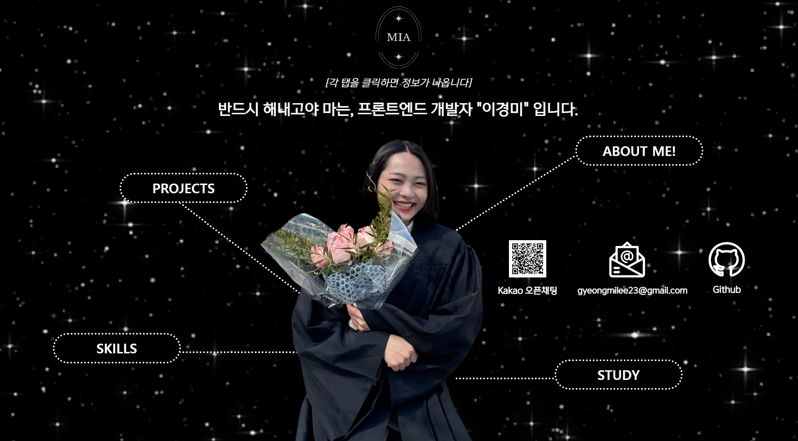

# Portfolio

   
  
   

## 포트폴리오 URL

https://gyeongmilee.github.io/portfolio/

 

## 이력서 

<a href="./이경미_최종노션입사지원서(pdf).pdf" download="이경미_이력서">눌러보세요!</a>

[![notion]](https://harmless-patio-fe8.notion.site/3d400b24a82c4f428ca3aefad1844080)
(클릭시 노션 페이지로 이동)
 

 

## 기술 스택

| JavaScript/JQuery |  HTML   |  CSS   |
| :---------------: | :-----: | :----: |
|       ![js]       | ![html] | ![css] |

 

## 라이센스

MIT &copy; [NoHack](mailto:lbjp114@gmail.com)

<!-- Stack Icon Refernces -->

[js]: /images/stack/javascript.svg
[html]: ./images/stack/html.svg
[css]: ./images/stack/css.svg
[notion]: ./images/stack/notion.svg

